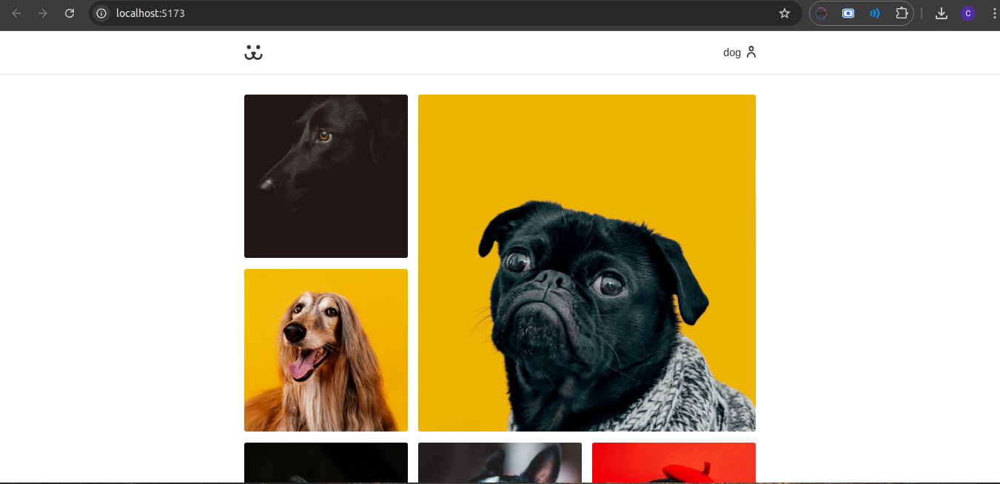
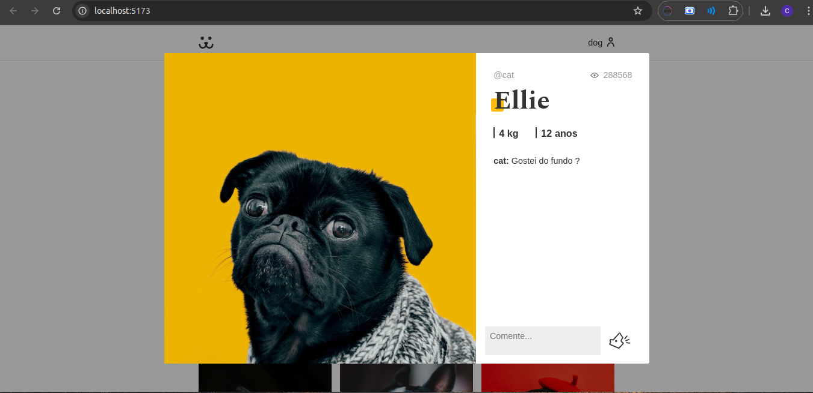
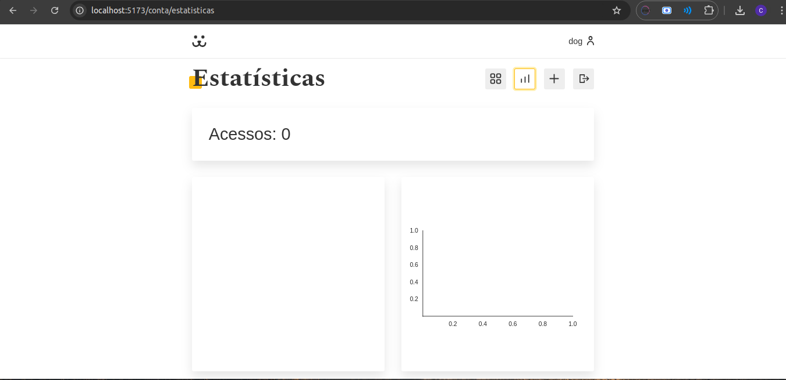
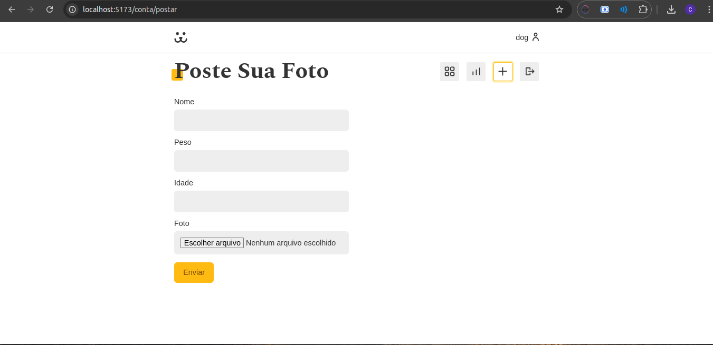
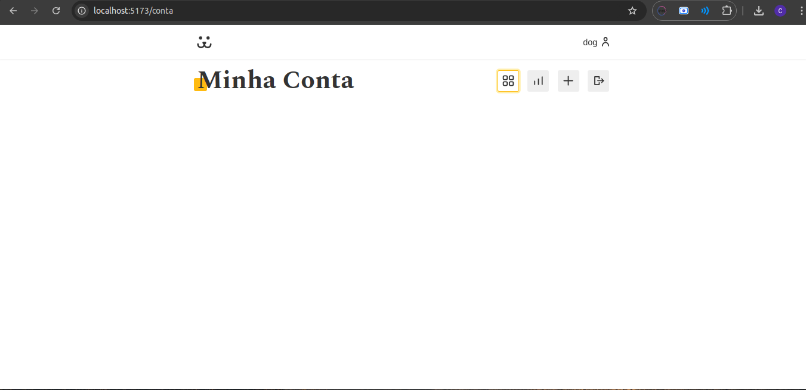
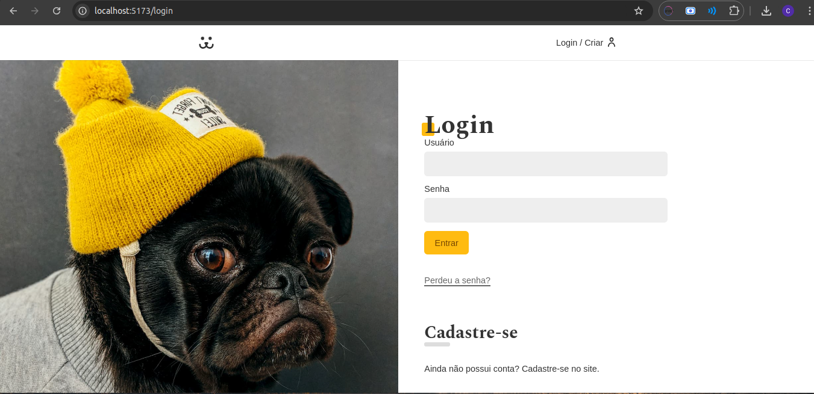
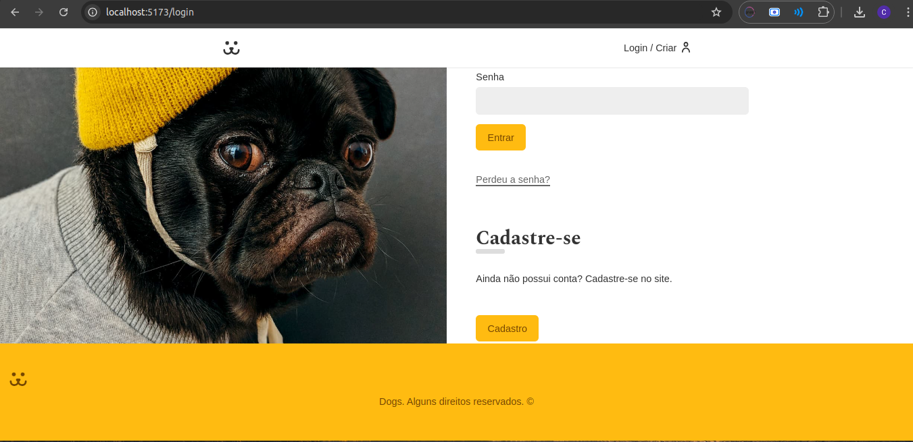
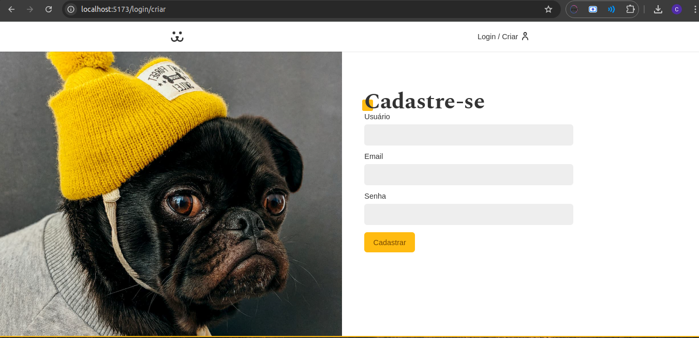

# Dogs - Compartilhamento de fotos de cães 🐾


**Dogs** é uma aplicação onde os usuários podem compartilhar fotos de seus cães, comentar nas postagens e visualizar estatísticas de visualizações.

## 🛠️ Funcionalidades
- Upload de fotos
- Feed de imagens
- Comentários nas postagens
- Visualização de estatísticas

## 🚀 Tecnologias
- React.js
- Vite.js
- React Router
- Victory (Gráficos)

## 📸 Screenshots









## 📦 Como rodar localmente
1. Clone o repositório:
   ```bash
   git clone https://github.com/seu-usuario/dogs.git

## Instale as dependências:
npm install

## Rode o servidor local:
npm run dev
